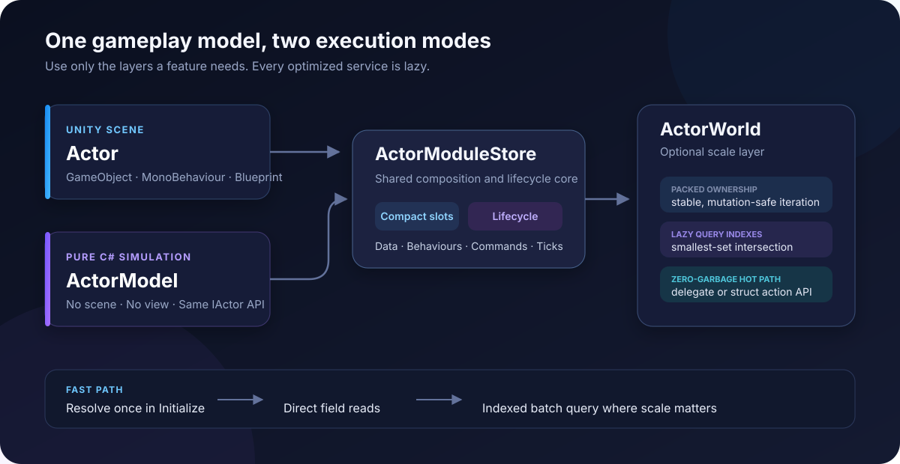

# Architecture and lifecycle

ABC separates composition, execution, and presentation while keeping one public actor contract.



## Actor contracts

`IReadOnlyActor` exposes identity, reactive state, typed module lookup, and destruction notification. `IActor` adds composition, commands, lifecycle control, and the three update phases.

`Actor` is a MonoBehaviour and implements `IActorView`. `ActorModel` is a sealed scene-free class. Behaviours that require a Transform make that requirement explicit:

```csharp
public void Initialize()
{
    if (Owner is not IActorView view)
        throw new InvalidOperationException("This behaviour requires a Unity view.");

    _transform = view.transform;
}
```

This keeps simulation behaviours usable in tests and dedicated-server code while allowing view behaviours to fail early with a clear message.

## Composition core

Both actor implementations use `ActorModuleStore`. It owns:

- data and behaviour maps;
- module lifecycle state;
- tick registries;
- command listener registries;
- ownership and rollback rules.

Registries are lazy. An actor with no commands, tick behaviours, reactive observers, or world queries does not allocate storage for those features.

Tick registries allocate only the update phases a behaviour actually implements. Command listener discovery is cached per behaviour type; runtime dispatch uses compact integer-ID entries instead of a per-actor `Dictionary<Type, ...>`.

## Type resolution

Each concrete module type receives a process-wide integer ID through a closed generic cache. Every actor stores only its own modules in a compact slot array, so registering many data types elsewhere in the application cannot inflate unrelated actors.

Exact access consists of:

1. reading the generic type ID;
2. comparing integer IDs in the actor's compact table;
3. returning the matching reference.

Small compositions stay array-only. Wide compositions automatically add an integer-keyed lookup and release it again when they shrink below the threshold. This keeps the common case compact while preventing access cost from growing without bound on unusually broad actors.

Interface and base-class access scans the actor's small module list once and caches the result. An ambiguous polymorphic request is rejected instead of returning an order-dependent module.

## Transactional lifecycle

Modules progress through explicit states:

1. Registered
2. Pre-initializing
3. Pre-initialized
4. Initializing
5. Initialized

All modules complete `PreInitialize` before the first `Initialize` call. If composition or initialization fails, ABC removes modules added after the transaction checkpoint and cleans every module that entered lifecycle execution.

Cleanup runs in reverse registration order. Actor and world destruction are idempotent. Exceptions in cleanup, destruction observers, update behaviours, or command listeners are isolated and logged so remaining cleanup and listeners still run.

## Scene ownership

`ActorModuleCollector` walks the current actor hierarchy with a reusable component buffer. A nested Actor stops ownership traversal for its descendants. This prevents a parent and child actor from accidentally sharing the same MonoBehaviour module.

## Scheduling

Scene actors register with the internal `ActorUpdateScheduler` only for phases used by their current behaviours. Registrations react to:

- initialization;
- runtime behaviour addition and removal;
- enable and disable;
- Kill and Revive;
- destruction.

The manager uses mutation-safe packed lists. Removing an actor or behaviour during an update never skips the next item.

## World ownership

`ActorWorld` uses packed actor storage with O(1) swap-back removal outside iteration. During a tick or query, removals become tombstones and spawns enter a pending buffer. The outermost iteration compacts once and appends pending actors.

Each model stores its current world slot, which lets removal avoid a linear search. `Clear` detaches all active and pending models and empties the indexes before invoking any destruction callbacks. Callbacks observe an empty world and cannot remove a sibling from the cleanup pass. Cleanup remains linear and destruction is idempotent.

Module ownership is checked by reference identity on composition changes using a weak-key ownership table. A data instance cannot be shared by two actors, and changing a behaviour's public `Owner` property does not bypass registration ownership. Removing one role from a module that implements both data and behaviour preserves ownership until its last role is removed. This adds cold registration storage, not lookup, tick, command, or query work.

## Query indexes

Queries are an optional layer over an ActorWorld. The first `Query<TData>()` creates a packed exact-type index and scans current models once. Later composition changes update only indexes that exist.

Each index contains:

- a packed actor-reference array;
- a parallel data-reference array;
- a sparse world-slot-to-packed-position array;
- pending storage for structural changes during iteration.

Multi-type queries select the smallest packed index, then test membership in the other sparse arrays. This avoids scanning unrelated world models without imposing per-model query metadata.

## External simulation and network identity

`ActorSimulation` advances one world through FixedTick and an optional physics callback. It reads no Unity clock and owns no world lifetime. A completed-step counter advances only after both phases return. Reentrancy is rejected; escaping failures fault the clock without pretending to roll back partially mutated gameplay. Existing per-behaviour exception isolation remains unchanged.

`Actor.AutomaticUpdates` and `ActorWorldRunner.AutomaticUpdates` let an adapter replace ABC's automatic scheduling without disabling composition. External clocks must also coordinate Unity or third-party physics explicitly.

`ActorNetworkMap` is an optional session-owned boundary object with narrow binding and lookup methods. Its two private maps use explicit `ActorNetworkId` values and actor reference identity, not mutable world slots or actor names. Destruction removes a binding; clearing a map releases subscriptions without destroying actors. No networking metadata is added to every model.

The runtime stays transport-independent. Wire schema, peer authority, reconnect epochs, reliable lifecycle delivery and snapshots belong to a game adapter. See [Networking and server simulation](Networking.md).

## Memory model

ABC data remains reference-oriented. Query indexes improve selection and dispatch cost, but they do not turn object data into contiguous value-type SoA storage. This is a deliberate usability tradeoff:

- stable object identity and interfaces are natural;
- behaviour dependencies can be cached as normal references;
- blueprint cloning remains straightforward;
- managed objects, strings, collections, and Unity references work without special component rules.

For simulations dominated by millions of unmanaged numeric values, a Burst-capable SoA ECS is a better fit. ABC is designed for scalable gameplay architecture without forcing that model on every mechanic.
