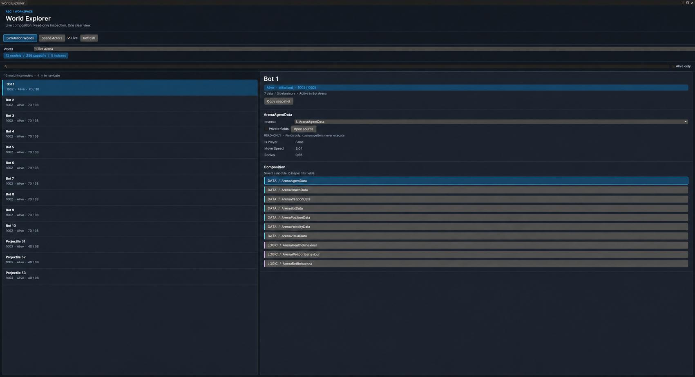
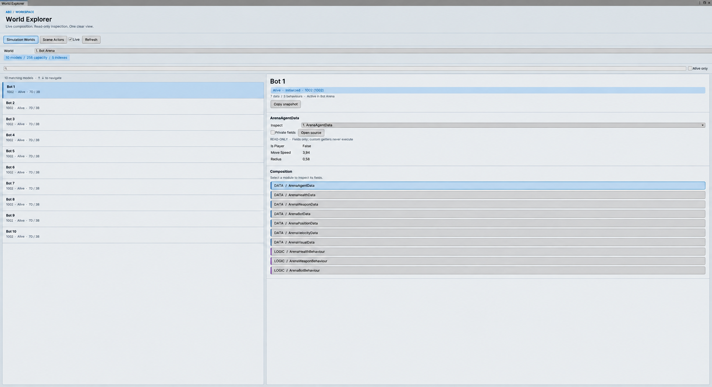

# Editor tooling

ABC ships its complete authoring workflow in the package. All ABC windows, inspectors, and the tag drawer use native UI Toolkit controls with shared USS styling. Odin Inspector, IMGUI wrappers, and other paid plugins are not required. Light and dark themes follow Unity's active skin.

## Actor inspector

The Actor inspector groups authoring into three cards:

- Identity contains the actor tag with built-in presets and a custom stable-ID field.
- Blueprints is a reorderable composition list.
- Lifecycle and Update controls initialization and scheduled phases.

Validation appears before Play Mode for missing or duplicate blueprint references. During Play Mode, the Runtime card displays lifecycle state, data count, behaviour count, and context-sensitive Initialize, Kill, or Revive controls.

## Blueprint inspector

The blueprint inspector discovers concrete providers through Unity `TypeCache`, cached per editor domain. **Add data** and **Add behaviour** open a searchable, keyboard-navigable picker. Search by module name or namespace; existing module types are marked and cannot be added twice.

Providers are embedded sub-assets. Expand a module to edit its serialized fields inline. Up/down controls change initialization order. Reordering, creation, field changes, and deletion participate in Unity Undo. Missing slots can be assigned an existing provider.

**Create Module Source** opens the Feature Scaffold directly from the Blueprint inspector. Removing a row destroys only an embedded provider owned by that Blueprint after its final local reference is removed; external shared assets are preserved.

The inspector reports:

- missing provider references;
- duplicate concrete module types;
- empty composition guidance.

Data and behaviour rows use distinct visual accents while preserving Unity Pro and Personal skin readability.

## ABC Dashboard

Open `Tools → ABC → Dashboard`.

The dashboard combines authoring and runtime diagnostics:

- scene Actor count;
- alive Actor count;
- live scene-free ActorWorld count;
- total ActorModel population;
- reserved world capacity;
- active exact-type query index count;
- one-click Actor, Actor World Runner, and Blueprint creation;
- one-click access to the Feature Scaffold;
- quick-start code and documentation access.

The ActorWorld diagnostic registry is compiled only in the Unity Editor and uses weak references. Open diagnostic windows retain their current inspection snapshot until refreshed or closed. Diagnostics add no player runtime work.

## World Explorer

Open `Tools → ABC → World Explorer` or use **Open World Explorer** on the Dashboard. Each world row on the Dashboard can also open that world directly.

The **Simulation Worlds** tab lists live `ActorWorld` instances. Choose a world to see its model count, reserved capacity, and active exact-type query indexes. The **Scene Actors** tab shows Actors in loaded scenes. Actor and World Runner inspectors can open the relevant item directly. Select a row to inspect its tag, lifecycle, data, behaviours, and read-only runtime field values. Scene Actors have a one-click **Select in Hierarchy** action.

Search is case-insensitive and combines space-separated terms. A plain term matches a name, tag, data type, or behaviour type. Narrow a term with `name:`, `tag:`, `data:`, or `behaviour:`; for example, `tag:Enemy data:Health`. The **Alive only** filter works in both tabs. `Ctrl/Cmd+F` focuses search, its clear control resets it, and **Refresh** captures the current state immediately.

The virtualized `ListView` reuses visible rows instead of constructing controls for every model. Arrow keys navigate the selection. **Live** refreshes membership, filters, and values once per second; turn it off for a manual snapshot. Only the active tab is scanned. Search is debounced, and the details tree is retained until the selected composition changes. Public and serialized fields and public auto-property storage are visible by default. **Private fields** also exposes cached state. The reader never invokes game-defined property getters or arbitrary `ToString` implementations.

**Open source** opens the selected module's matching script asset when source is available. **Copy snapshot** places identity, module types, and visible values on the clipboard for issue reports or AI-assisted debugging. The Explorer does not edit runtime objects and never adds diagnostics to a player build. Wide windows show list and details side by side; narrow windows stack independently scrollable panes. The Inspect dropdown switches modules without scrolling through the composition.

## Project setup and folder freedom

ABC does not require `Assets/Game`, `_Project`, or any other gameplay directory. It discovers modules by type and uses Unity asset references. The Unity project itself may be nested anywhere inside a repository.

Open `Tools → ABC → Project Setup` or `Edit → Project Settings → ABC` to choose the default feature folder and namespace. Save these in `ProjectSettings/ABC.asset` alongside the project's other settings. Existing folders are tracked by Unity GUID, so moving a selected folder in the Project window updates the resolved destination. A not-yet-created folder is stored as a project-relative path.

The Feature Scaffold displays setup guidance until defaults have been saved. **Browse**, **Use Selected Folder**, and editable fields let each feature override the defaults. Generated source goes into any chosen folder under `Assets`; this is a source-output boundary, not a prescribed project layout. ABC does not silently write into installed packages or change assembly definitions. For projects using custom `.asmdef` files, add a reference to `abc.unity` in the assembly containing generated gameplay code.

There is no mandatory startup popup and saving defaults creates no gameplay assets. The runtime and World Explorer work without completing setup.

## Feature Scaffold

Open `Tools → ABC → Feature Scaffold`.

The scaffold creates a coherent feature slice from one name and namespace:

- serializable actor data;
- behaviour with dependencies cached during `Initialize`;
- typed command and local listener;
- zero-boxing struct query action;
- optional data and behaviour providers for Blueprint authoring.

Generated behaviours are not scheduled for per-frame updates until you explicitly add `IActorTick`, `IActorFixedTick`, or `IActorLateTick` and the corresponding method.

The preview shows the exact file set and each file's complete source before generation. Output is deterministic normal C#, existing source is never overwritten, and every generated file can be edited or deleted without a generator package. Generation runs only in the editor and adds no runtime service, analyzer, DLL, reflection path, or player dependency.

Agents and CI can run `Abc.Unity.Editor.ActorFeatureScaffold.Generate` using Unity's `-executeMethod` with `-abcFeature`, `-abcNamespace` and `-abcOutput`. See [AI-ready development](AIReady.md) for the command. The window and command-line entry share the same safe writer.

## Menus

| Action | Menu |
| --- | --- |
| Create scene actor | `GameObject → ABC → Actor` |
| Create world runner | `GameObject → ABC → Actor World Runner` |
| Create actor blueprint | `Assets → Create → ABC → Blueprints → Actor` |
| Open dashboard | `Tools → ABC → Dashboard` |
| Inspect worlds and scene actors | `Tools → ABC → World Explorer` |
| Generate a feature slice | `Tools → ABC → Feature Scaffold` |
| Configure source defaults | `Tools → ABC → Project Setup` |

## Assembly isolation

All custom editors live in `abc.unity.editor` with `Editor` as its only platform. Runtime internals needed for diagnostics are exposed with `InternalsVisibleTo`; no editor API enters `abc.unity` player assemblies.

## Visual verification

The editor assembly is compiled and tested in both Unity 2022.3 LTS and Unity 6 validation projects. World Explorer was checked in wide and narrow layouts; Blueprint serialized fields and light/dark skin switching were checked in the running Unity 2022.3 sample project. The screenshots below show real Bot Arena runtime models, not mockups. Unity's Play Mode tint also affects editor colors.

When changing the shared styles, recheck the Actor inspector, Blueprint inspector, Dashboard, and World Explorer in both skins, including keyboard navigation and narrow windows. Refresh these images when the visible workflow changes.
