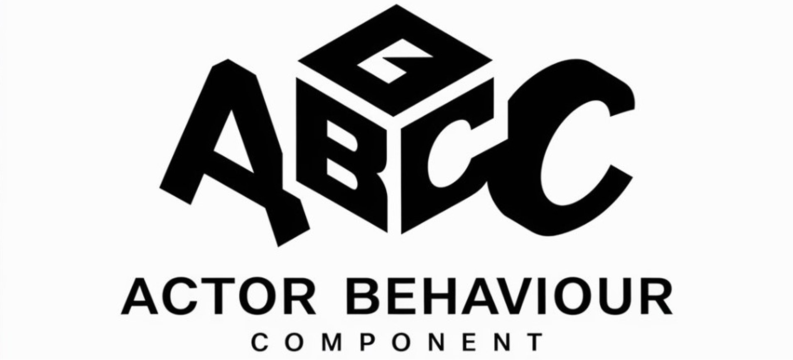

<p align="center">
    
</p>

# ABC - Actor Behaviour Component простейший C# фреймворк, как ECS только проще!
Данный фреймворк был разработан в рамках работы в университете над архитектурой проекта, ECS как показывает практика изучается
не так быстро как хотелось бы, этот фреймворк создан для того, чтобы значительно ускорить процесс обучения команды, а также 
сделать код более гибким и читаемым!

# Лицензия
Фреймворк выпускается под лицензией MIT, [подробности тут](./LICENSE).

# Интеграция с движками

## Unity
> Проверено на Unity 2020.3 (не зависит от нее) и содержит asmdef-описания для компиляции в виде отдельных сборок и уменьшения времени рекомпиляции основного проекта.

# Установка

## В виде unity модуля
Поддерживается установка в виде unity-модуля через git-ссылку в PackageManager:
```
"com.abc.unity": "https://github.com/datuloar/abc.unity.git",
```
По умолчанию используется последняя релизная версия. Если требуется версия "в разработке" с актуальными изменениями - следует переключиться на ветку `develop`:
```
"com.abc.unity": "https://github.com/datuloar/abc.unity.git#develop",
```

# Основные типы

## Actor
Это контейнер компонентов и поведения, Actor можно поместить на сцену как MonoBehaviour.
Actor может отправлять команды, которые слушают только Behaviour.

> **ВАЖНО!** Он всегда должен находится там, где есть поведения и компоненты.

## Компонент
Является контейнером для данных пользователя и не должен содержать логику:
```c#
class JumpComponent : IComponent {
    public int Speed;
}
```

## Behaviour
Поведение, здесь обрабатывается вся логика.
Существует в виде пользовательского класса, реализующего как минимум один из `IBehaviour`;
Функционал можно расширить добавив несколько интерфейсов:
`ITickable` && `IFixedTickable` - Служит для апдейта логики,
`ICommandListener` - принимает команды от Actor, а также может отправлять свои команды.
Каждый Behaviour знает о Actor, который ими владеет и соответственно может посылать команды другим Behaviour.

# TODO:
* Дописать документацию
* Реализовать общие Behaviour