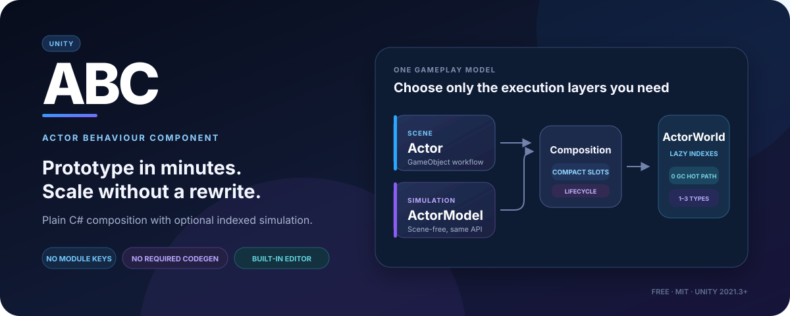
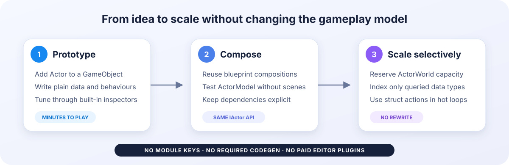

<p align="center">
  
</p>

<p align="center">
  <strong>Prototype like ordinary Unity code. Scale with indexed, allocation-free simulation.</strong>
</p>

<p align="center">
  
  
  
  
  
</p>

# ABC

ABC is a free Actor Behaviour Component framework for Unity. It combines an approachable object-oriented workflow with an optional data-oriented runtime for large simulations.

- `Actor` composes normal GameObjects, MonoBehaviours, data, commands, and reusable blueprints.
- `ActorModel` runs the same gameplay API without GameObjects.
- `ActorWorld` owns model lifetime, mutation-safe updates, and lazy exact-type query indexes.
- Built-in inspectors and the ABC Dashboard work without Odin or another paid dependency.
- The optional Feature Scaffold emits normal editable C# and adds no generator runtime.
- C# types are module keys. There are no user-declared module IDs, API declarations, generated accessor DLLs, or registration bootstrap.

<p align="center">
  
</p>

## Contents

- [Why ABC](#why-abc)
- [Install](#install)
- [90-second start](#90-second-start)
- [AI-ready by design](#ai-ready-by-design)
- [Scale without a rewrite](#scale-without-a-rewrite)
- [Unity workflow](#unity-workflow)
- [Performance contract](#performance-contract)
- [Design comparison](#design-comparison)
- [Documentation](#documentation)

## Why ABC

Small Unity prototypes are fast to start with MonoBehaviours, but shared state, lifecycle, and testing become harder as the project grows. A high-performance ECS solves different problems, yet often introduces world declarations, component registration, systems, filters, baking, and structural rules before the first mechanic works.

ABC keeps one composition model across both stages:

1. Write plain data and behaviour classes.
2. Run them on a GameObject `Actor` or a scene-free `ActorModel`.
3. Move high-volume logic into an indexed `ActorWorld` query without changing the data model.

<p align="center">
  
</p>

ABC is intentionally not a struct/SoA ECS. If a project needs millions of tightly packed numeric components, Burst jobs, or deterministic world snapshots, a specialized ECS remains the right tool. ABC targets the large space between ad-hoc MonoBehaviours and full ECS adoption.

## Install

ABC requires Unity 2021.3 or newer and the .NET Standard 2.1 API profile.

Add the Git package to `Packages/manifest.json`:

```json
{
  "dependencies": {
    "com.abc.unity": "https://github.com/datuloar/abc.unity.git"
  }
}
```

Import the Basic sample for the smallest learning path or Bot Arena for a playable production-shaped example. No source generator, analyzer label, scripting define, or third-party inspector is required.

## 90-second start

Data and behaviours are ordinary reference types. A behaviour resolves dependencies once during initialization and uses direct field access in its hot path.

```csharp
using Abc.Unity;

public sealed class HealthData : IActorData
{
    public int Value { get; set; }
}

public sealed class RegenerationBehaviour : IActorBehaviour, IActorTick
{
    private HealthData _health;

    public IActor Owner { get; set; }

    public void Initialize()
    {
        _health = Owner.GetData<HealthData>();
    }

    public void Tick(float deltaTime)
    {
        _health.Value++;
    }
}
```

Compose and run a model:

```csharp
using var world = new ActorWorld("Combat", 1000);

var enemy = new ActorModel("Enemy", ActorTag.Enemy)
    .WithData(new HealthData { Value = 100 })
    .WithBehaviour(new RegenerationBehaviour());

world.Add(enemy);
world.Tick(Time.deltaTime);
```

`ActorWorld.Add` initializes the model. `Dispose`, `Clear`, and `Despawn` perform deterministic cleanup. Spawn and removal during Tick, FixedTick, LateTick, or a query are applied safely without invalidating the current iteration.

Tags are compact serializable values, not a closed package enum. Built-ins remain available as `ActorTag.Player` and `ActorTag.Enemy`; game-specific tags use stable IDs such as `new ActorTag(1001)` and work in the inspector, registry, and world query filters without string lookup.

Scene-backed actors are discoverable through the read-only `ActorRegistry`. Registration and removal are lifecycle-owned internals, so game code can query or observe actors without corrupting tag indexes.

## AI-ready by design

ABC keeps generation context small: one runtime namespace, one composition model, explicit lifecycle rules, and ordinary C# files. The repository-level [AGENTS.md](AGENTS.md) gives coding agents a compact architecture map, invariants, performance constraints, and a definition of done.

Open `Tools → ABC → Feature Scaffold` to create a compile-ready feature slice. Select data, behaviour, command, zero-boxing query action, and Blueprint providers; the tool previews every output file and refuses to overwrite existing source. Generated files are deterministic, readable, editable, and safe to commit. There is no generator DLL, analyzer setup, hidden runtime registry, or player dependency.

Humans and agents use the same code. Generated behaviour dependencies are cached during `Initialize`, generated query actions use the allocation-free struct path, and Blueprint boilerplate is optional and automated.

## Scale without a rewrite

Create a query only where batch processing is useful:

```csharp
world.Query<HealthData>()
    .WithTag(ActorTag.Enemy)
    .OnlyAlive()
    .For(static (actor, health) => health.Value++);
```

The delegate overload is concise for prototypes. A struct action removes delegate dispatch from the per-model loop while preserving state without boxing:

```csharp
public sealed class PositionData : IActorData
{
    public Vector3 Value;
}

public sealed class VelocityData : IActorData
{
    public Vector3 Value;
}

public struct MoveAction : IActorQueryAction<PositionData, VelocityData>
{
    public float DeltaTime;

    public void Execute(ActorModel actor, PositionData position, VelocityData velocity)
    {
        position.Value += velocity.Value * DeltaTime;
    }
}
```

```csharp
var query = world.Query<PositionData, VelocityData>();
var action = new MoveAction { DeltaTime = Time.deltaTime };
query.For(ref action);
```

Query indexes are created lazily per concrete data type. A one-type query walks a packed reference array. Multi-type queries start from the smallest index and perform O(1) sparse membership checks against the remaining indexes. Warmed-up iteration creates no garbage.

Queries currently support one to three concrete data types plus `WithTag`, `WithoutTag`, and `OnlyAlive`. Polymorphic `GetData<TInterface>()` remains available for composition, while world queries deliberately require exact concrete types for predictable indexing.

## Unity workflow

### Scene actors

Add `ABC/Actor` to a GameObject, attach module MonoBehaviours, and optionally assign reusable blueprints. A parent actor does not capture modules below a nested actor.

The centralized update manager schedules only actors that have work for the enabled update phase. Disabling an actor removes it from scheduling. `Kill` pauses it without deleting state; `Revive` restores it.

Add `ABC/Actor World Runner` when a scene should own and automatically tick a scene-free world. Other components can receive the runner explicitly and use `runner.World` without introducing a global singleton.

### Blueprints

`ActorBlueprint` is reusable composition data. Each actor receives independent data and behaviour instances, preventing mutable state from leaking between actors.

The built-in blueprint inspector provides:

- searchable type discovery through Unity `TypeCache`;
- nested provider editing;
- duplicate prevention;
- drag reordering and Undo;
- missing-reference and composition validation.

### Dashboard

Open `Tools → ABC → Dashboard` to see:

- scene actor, initialized, and alive counts;
- live `ActorWorld` instances, model counts, capacity, and active query indexes;
- one-click Actor, Actor World Runner, and Blueprint creation;
- a scene-free quick start and documentation access.

All tooling is in the editor-only `abc.unity.editor` assembly and is excluded from players.

### Bot Arena sample

Bot Arena is a playable top-down shooter built only from ABC and Unity built-ins. It combines Blueprint-authored bot defaults, scene-free `ActorModel` instances, local fire and damage commands, cached behaviour dependencies, mutation-safe spawning and destruction, and one-to-three-data struct queries. Press `B` to add 100 bots and inspect the live model and query-index counts in the ABC Dashboard.

<p align="center">
  
</p>

Open `Samples/Bot Arena/Scenes/BotArena`, enter Play Mode, move with WASD, aim with the mouse, and fire with the left mouse button or Space. The presentation uses built-in primitives and the Built-in Render Pipeline, with no paid assets. URP/HDRP projects need adapted presentation materials; the ABC runtime itself is render-pipeline independent.

## Data access and lifecycle

Concrete module types receive a process-wide generic integer ID once. Each actor keeps a compact contiguous slot table instead of reserving space for every type known by the application. Typical small compositions use a short integer scan; unusually wide compositions promote automatically to an integer-keyed lookup. Warmed-up exact `GetData<T>()` and `GetBehaviour<T>()` perform no reflection, `Type` hashing, string lookup, or allocation.

Interface and base-class requests are resolved once per actor and cached. They succeed only when exactly one module matches. Ambiguous `TryGet` calls return `false`; their `Get` counterparts throw a descriptive exception.

Each unique module receives:

1. `PreInitialize`
2. `Initialize`
3. `CleanUp`

All modules finish `PreInitialize` before initialization begins. Runtime additions initialize immediately. Failed composition or initialization rolls back transactionally. Cleanup runs in reverse registration order and is idempotent.

## Commands

Commands are strongly typed and local to one actor:

```csharp
public readonly struct DamageCommand : IActorCommand
{
    public DamageCommand(int amount) => Amount = amount;

    public int Amount { get; }
}

public sealed class DamageBehaviour : IActorBehaviour, IActorCommandListener<DamageCommand>
{
    private HealthData _health;

    public IActor Owner { get; set; }

    public void Initialize() => _health = Owner.GetData<HealthData>();

    public void ReactActorCommand(DamageCommand command) => _health.Value -= command.Amount;
}
```

```csharp
enemy.SendCommand(new DamageCommand(10));
```

Listener discovery reflects once per behaviour type and caches the result. Command types then use generic integer IDs and each actor stores only its compact set of active listeners. Dispatch is mutation-safe, isolates listener failures, and has no warmed-up GC allocations.

## Performance contract

The repository contains deterministic regression tests built on Unity `ProfilerRecorder` and its `GC.Alloc` marker. The final Unity 2022.3.62f2 and Unity 6.0.71f1 Editor/Mono validation runs on the development machine produced:

| Operation | Unity 2022.3 | Unity 6.0 |
| --- | ---: | ---: |
| Indexed one-data query | 1.40 ns/model | 1.33 ns/model |
| Indexed two-data intersection | 7.86 ns/model | 7.36 ns/model |
| Exact `GetData<T>()` | 13.22 ns/op | 11.83 ns/op |
| Command dispatch | 10.80 ns/op | 9.67 ns/op |
| `ActorWorld` behaviour dispatch | 10.04 ns/model | 8.92 ns/model |
| Warmed-up lookup, query, tick, command | 0 `GC.Alloc` samples | 0 `GC.Alloc` samples |
| Empty `ActorModel` retained footprint | 94.82 B/model | 91.75 B/model |
| One-data model including data | 393.42 B/model | 388.30 B/model |
| One tick-and-command behaviour model | 791.14 B/model | 787.46 B/model |

Timing rows are five-sample medians. Results depend on CPU, Unity version, scripting backend, build configuration, and profiler state. These numbers describe this repository's test shape, not a cross-framework benchmark. Run `ActorPerformanceTests` in the target project before making platform decisions.

Runtime hot paths avoid LINQ, enumerator boxing, per-frame reflection, transient collections, and repeated type hashing. Registries and query indexes are lazy; an unused feature has no per-model storage cost.

## Design comparison

| Concern | ABC | Key-based actor framework | High-performance ECS |
| --- | --- | --- | --- |
| First prototype | Plain classes and optional GameObjects | Keys, installers, wrappers | World, component, system, query setup |
| Typed access | C# type is the key | Generated or handwritten key accessor | Generic component pool |
| Code generation | Optional visible scaffold; never required | Common for ergonomic APIs | Optional or common |
| Inspector | Built in and free | Often improved by paid tooling | Usually separate integration |
| Scene-free model | Same `IActor` API | Usually supported | Native |
| Batch processing | Lazy packed reference indexes | Filters or entity collections | SoA/bitmap/archetype queries |
| Structural mutation | Stable, deferred during iteration | Framework-specific | Framework-specific rules |
| Best fit | Fast gameplay architecture from prototype to large model sets | Rich object-oriented gameplay primitives | Maximum numeric throughput and huge simulations |

ABC's differentiation is continuity: teams can begin with readable object-oriented gameplay and add indexed processing selectively, without translating the project into a second architecture.

See [Market and design comparison](Documentation~/Comparison.md) for a source-linked comparison with Atomic, Massive ECS, StaticEcs, and Unity Entities. It separates measured ABC results from architectural claims and states where a specialized ECS remains the stronger choice.

## Validation

The current validation contains 89 EditMode tests: 80 package tests and 9 imported Bot Arena tests. Coverage includes lifecycle order and rollback, cross-actor module isolation, exact and polymorphic lookup, compact-to-wide module map transitions, serialized Blueprint cloning, nested ownership, self-destruction during initialization, command failures and mutation, reentrant world cleanup, randomized composition changes, custom tag serialization, query filtering, public API encapsulation, cached views, world slot stability, one/two/three-type queries, scaffold determinism, continuous projectile collision, retained memory, and warmed-up allocations.

The package and editor assembly are validated on Unity 2022.3 LTS and Unity 6. A Windows Mono player build plus the imported Basic and Bot Arena samples are also checked. The package targets Unity 2021.3+, but that minimum version was not available on the validation machine.

## Documentation

- [Getting started](Documentation~/GettingStarted.md)
- [Architecture and lifecycle](Documentation~/Architecture.md)
- [High-performance queries](Documentation~/Queries.md)
- [Editor tooling](Documentation~/EditorTooling.md)
- [AI-ready development](Documentation~/AIReady.md)
- [Migrating to ABC 2.0](Documentation~/Migration2.md)
- [Market and design comparison](Documentation~/Comparison.md)
- [Performance methodology](Documentation~/Performance.md)
- [ABC 2.0 audit and validation scope](Documentation~/Audit2.md)

## License

ABC is available under the [MIT License](LICENSE).
