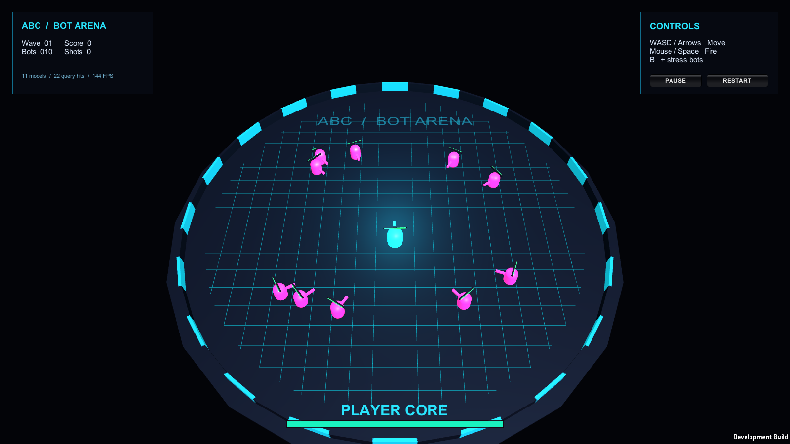

# ABC Bot Arena

Bot Arena is the advanced ABC sample. It is a complete top-down shooter made with Unity built-ins and no external art, input, inspector, or runtime packages.

The presentation targets the Built-in Render Pipeline. Adapt its materials before using URP or HDRP; the gameplay model does not depend on a render pipeline.

Open `Scenes/BotArena`, enter Play Mode, and use:

- WASD or arrow keys to move;
- mouse to aim;
- left mouse button or Space to fire;
- `B` to add 100 stress-test bots;
- `P` to pause;
- `R` to restart.

## What it demonstrates

| ABC feature | Sample implementation |
| --- | --- |
| Scene-free gameplay | Every player, bot, and projectile is an `ActorModel` |
| Ownership | One `ActorWorld` owns every model and its deterministic cleanup |
| Reusable authoring | The assigned `BotBlueprint` supplies independent bot data instances |
| Local messages | Fire and damage use typed actor commands |
| Cached dependencies | Behaviours resolve data once in `Initialize` |
| Indexed scale | Movement, projectile, collision, and presentation use cached world queries |
| Zero-boxing iteration | The simulation loop passes struct actions by `ref` |
| Safe mutation | Bots and projectiles spawn or despawn while ticks and queries are active |
| Runtime visibility | The HUD exposes counts; World Explorer inspects each model and its state |

## Reading order

1. Start with `BotArenaBootstrap` to see the entire frame pipeline.
2. Read `ArenaSession` for composition and lifecycle.
3. Read the four behaviours for dependency caching and typed commands.
4. Inspect `BotBlueprint` to see editable reusable defaults.
5. Read the data types last; they intentionally contain only state and narrow mutations.

Wave one uses the Blueprint's movement, collision radius, health, weapon, and range defaults. Later waves apply bounded difficulty multipliers to those defaults; they do not replace them with hard-coded stats. Orbit direction alternates between spawned bots.

The scene's Bot Arena component holds explicit Blueprint and material references. The imported sample and its assets can be moved inside Unity without changing code; preserve their `.meta` files. No runtime lookup depends on a `Resources` folder or the sample import path.

Projectile collision uses relative swept segments, including target movement, and selects the earliest hit. The last partial lifetime step is checked before despawning. Target data is cached at spawn. The broad phase is still a linear target scan, so this sample is not a massive-entity collision benchmark; profile spatial partitioning before extending it to much larger combat populations.

After importing the sample, its nine EditMode collision tests appear in `abc.unity.samples.bot-arena.tests` when the Unity Test Framework is available. The allocation assertion covers the hit-test calculation, not GameObject spawning, particles, or HUD rendering.

The simulation and presentation are separate. `ArenaVisualData` is ordinary actor data containing Unity references, while movement and combat state remain usable without GameObjects. A production project can replace `ArenaVisualFactory` without rewriting gameplay.

The legacy Unity Input Manager is used so the sample remains dependency-free. Projects configured for the new Input System only can replace `ArenaPlayerBehaviour` while leaving the rest of the sample unchanged.
